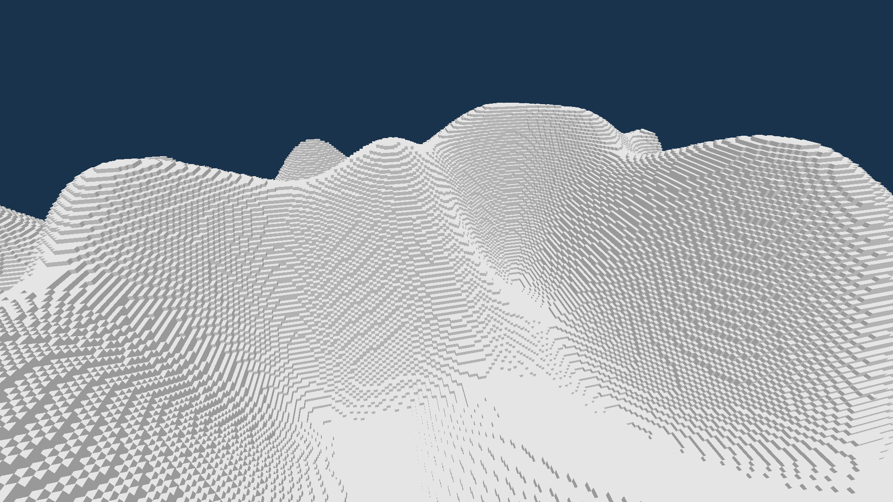

# Voxel Renderer
A prototype minecraft-style voxel renderer written in zig using the sokol library for graphics.

## Features
- Chunk based rendering
- Infinite terrain generation
- Smart loading/unloading of out-of-view chunks

## Zig Version
Requires Zig version 0.13.0

## Controls
- WASD - Movement
- Shift - Go Down
- Space - Go Up
- Esc - Toggle Mouse Lock

## Screenshot

## Known Issues
There is some kind of vram leak going on internally and I'm not to sure why that is.
